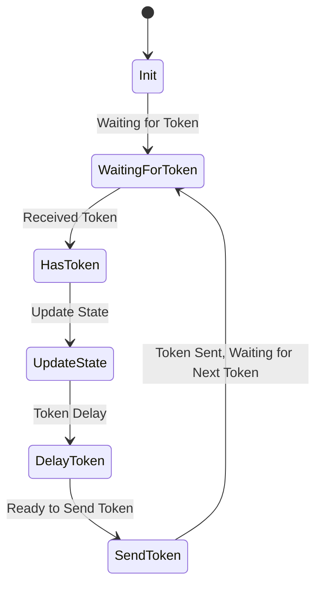
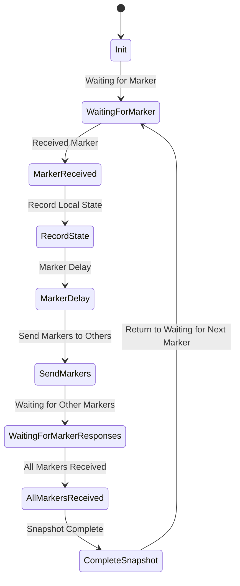

```mermaid
stateDiagram-v2
    [*] --> Init
    Init --> WaitingForToken: Waiting for Token
    WaitingForToken --> HasToken: Received Token
    HasToken --> UpdateState: Update State
    UpdateState --> DelayToken: Token Delay
    DelayToken --> SendToken: Ready to Send Token
    SendToken --> WaitingForToken: Token Sent, Waiting for Next Token
```

```mermaid
stateDiagram-v2
    [*] --> Init
    Init --> WaitingForMarker: Waiting for Marker
    WaitingForMarker --> MarkerReceived: Received Marker
    MarkerReceived --> RecordState: Record Local State
    RecordState --> MarkerDelay: Marker Delay
    MarkerDelay --> SendMarkers: Send Markers to Others
    SendMarkers --> WaitingForMarkerResponses: Waiting for Other Markers
    WaitingForMarkerResponses --> AllMarkersReceived: All Markers Received
    AllMarkersReceived --> CompleteSnapshot: Snapshot Complete
    CompleteSnapshot --> WaitingForMarker: Return to Waiting for Next Marker
```
