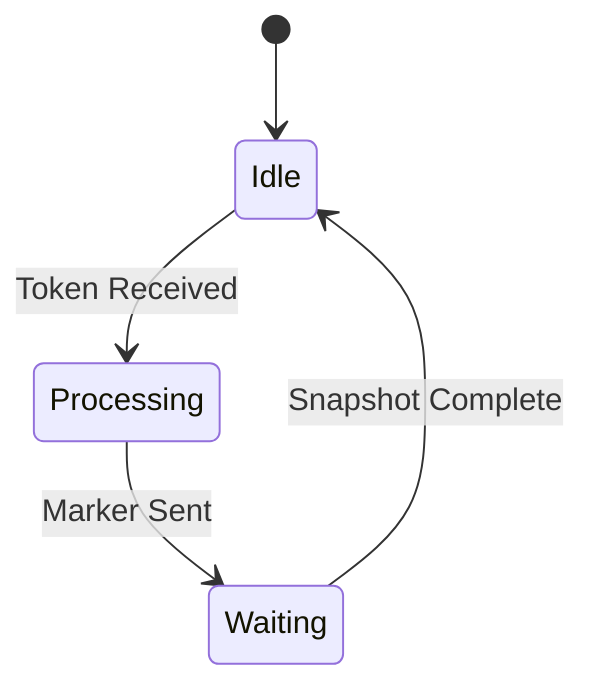

보내는 입장
1. Snapshot initiated
2. Record its own state
3. Send Marker to each channel (Every processes)
	1. Marker MEssage is NOT a state that the snapshot algorithm is trying to record
	2. Snapshot 찍을때는 아무런 작업하지마라

Receiver
1. Marker Message Arrived
	1. Has seen
	2. First
		1. Record its state
		2. Mark the channel (Close)
			1. NO MORE MESSAGE TO COME
			2. OR) Not gonna be recorded
		3. Send Marker to everyone
		4. $C_ki$ 빼고는 전부 다 record