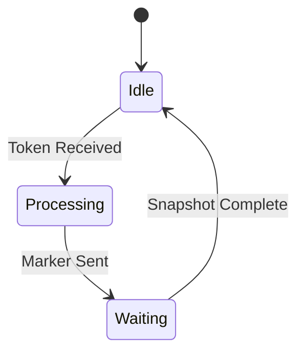
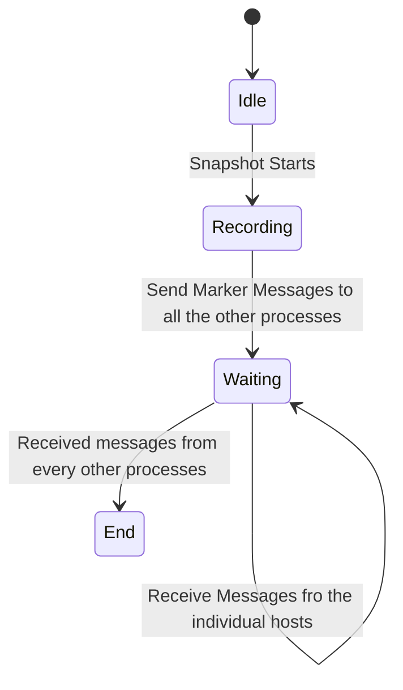
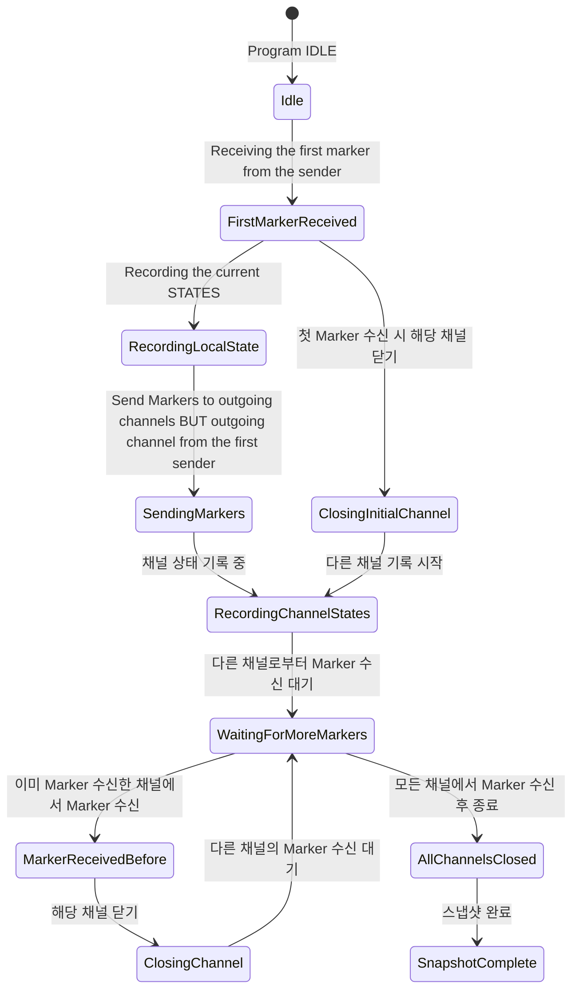
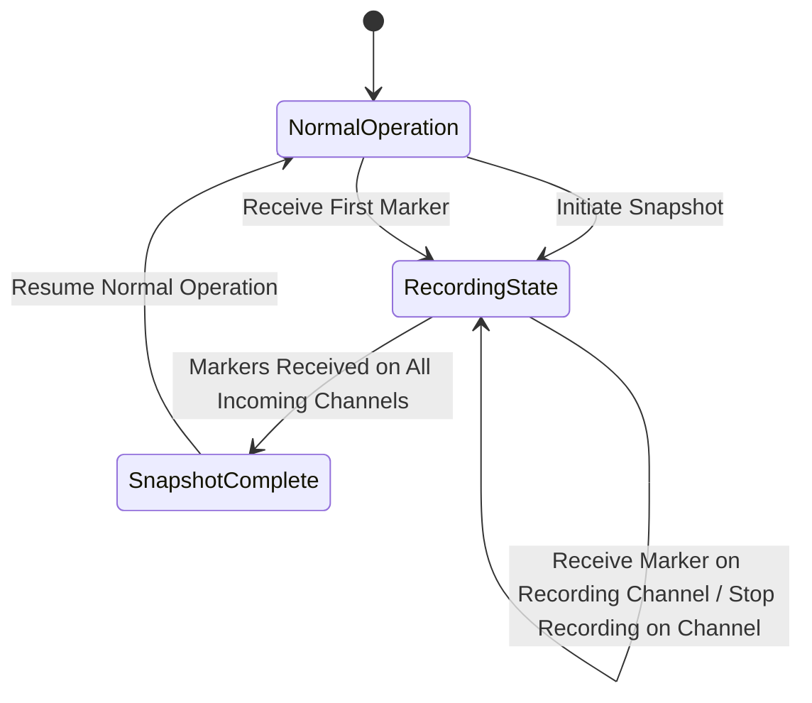
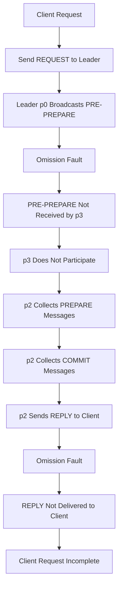
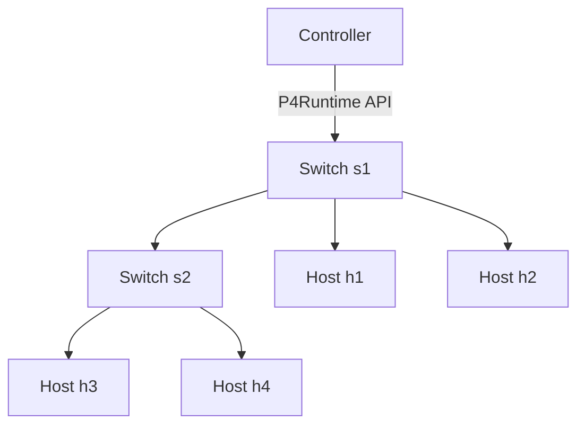
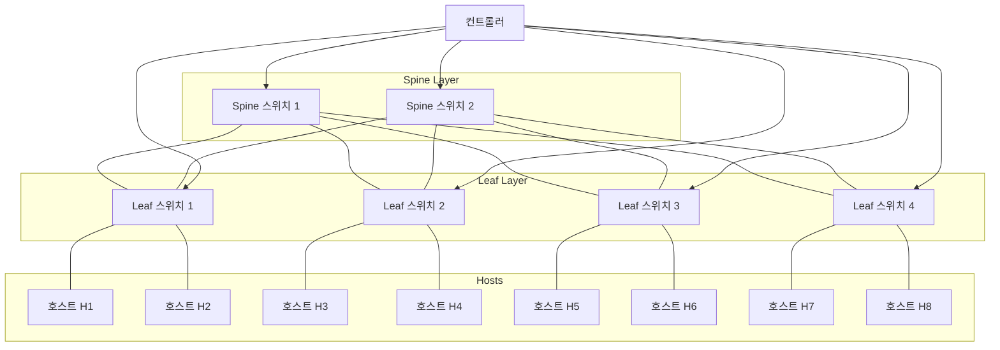
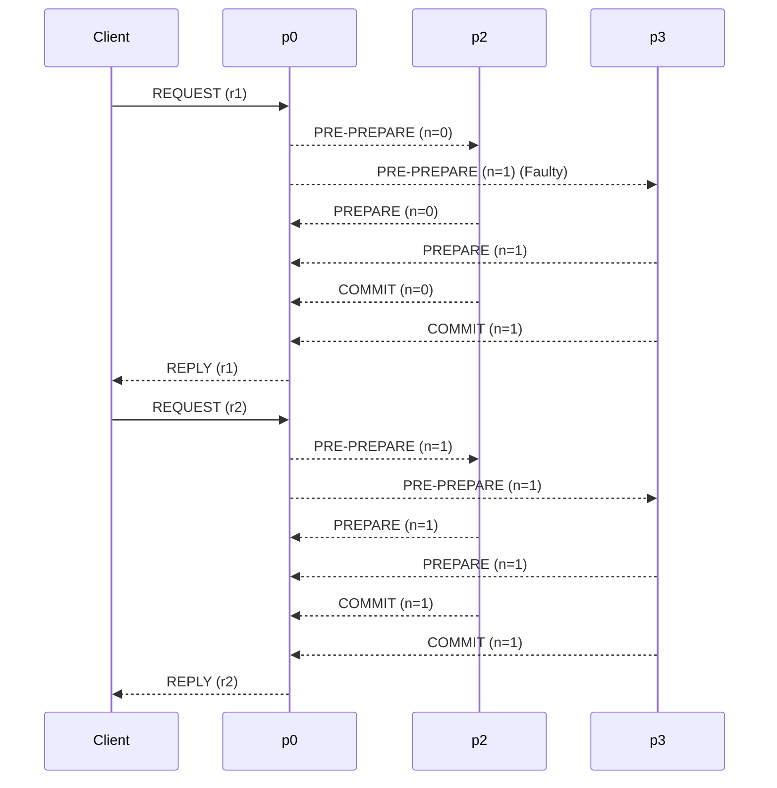

보내는 입장
1. Snapshot initiated
2. Record its own state
3. Send Marker to each channel (Every processes)
	1. Marker MEssage is NOT a state that the snapshot algorithm is trying to record
	2. Snapshot 찍을때는 아무런 작업하지마라

Receiver
1. Marker Message Arrived
	1. Has seen
		1. Stop Recording
	2. First
		1. Record its state - 기록하고
		2. Mark the channel (Close) - 들어온 큐 막고
			1. NO MORE MESSAGE TO COME
			2. OR) Not gonna be recorded
		3. Send Marker to everyone - 마커 init 한애 빼고 다 보내기
		4. $C_ki$ 빼고는 전부 다 record

# Sender

s1 --> s2: A transition
s2 : This is a state description

## Receiver

예를 들어 P1,P2,P3,P4가 있으면

  

1. P1이 스냅샷을 시작한다
2. P1이 상태를 저장한다
3. P1 이 P2,P3,P4에 마커를 보낸다
4. P2,P3,P4는 마커를 받은 채널을 폐쇠한다 (더이상 받지 않음)
	1. 폐쇠된 채널
		1. P1->P2
		2. P1->P3
		3. P1->P4
5. P2,P3,P4는 상태저장을 시작한다 (순간저장이 아니라 지속적으로 저장한다)
6. 각각 다른채널로 마커를 보낸다
	1. P2->P3,P4
	2. P3->P2,P4
	3. P4->P3,P4

MARKER 주석

