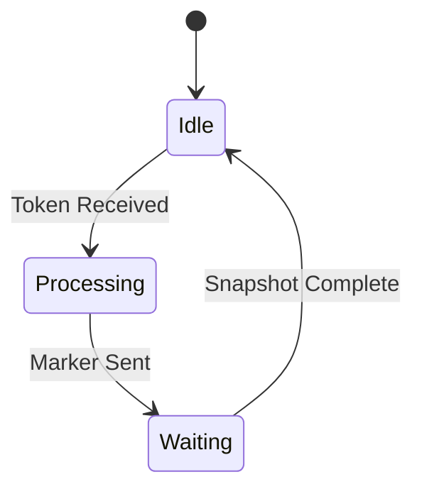


보내는 입장
1. Snapshot initiated
2. Record its own state
3. Send Marker to each channel (Every processes)
	1. Marker MEssage is NOT a state that the snapshot algorithm is trying to record
	2. Snapshot 찍을때는 아무런 작업하지마라

Receiver
1. Marker Message Arrived
	1. Has seen
		1. Stop Recording
	2. First
		1. Record its state - 기록하고
		2. Mark the channel (Close) - 들어온 큐 막고
			1. NO MORE MESSAGE TO COME
			2. OR) Not gonna be recorded
		3. Send Marker to everyone - 마커 init 한애 빼고 다 보내기
		4. $C_ki$ 빼고는 전부 다 record


# Sender
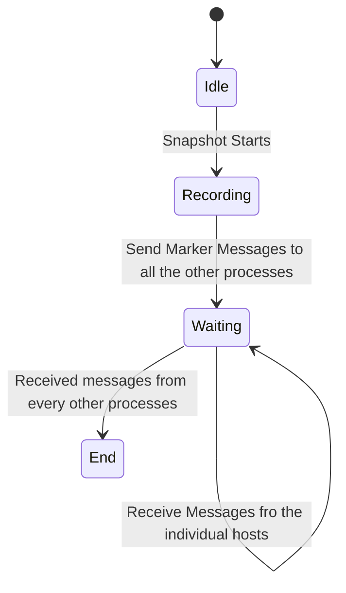
s1 --> s2: A transition
s2 : This is a state description

## Receiver


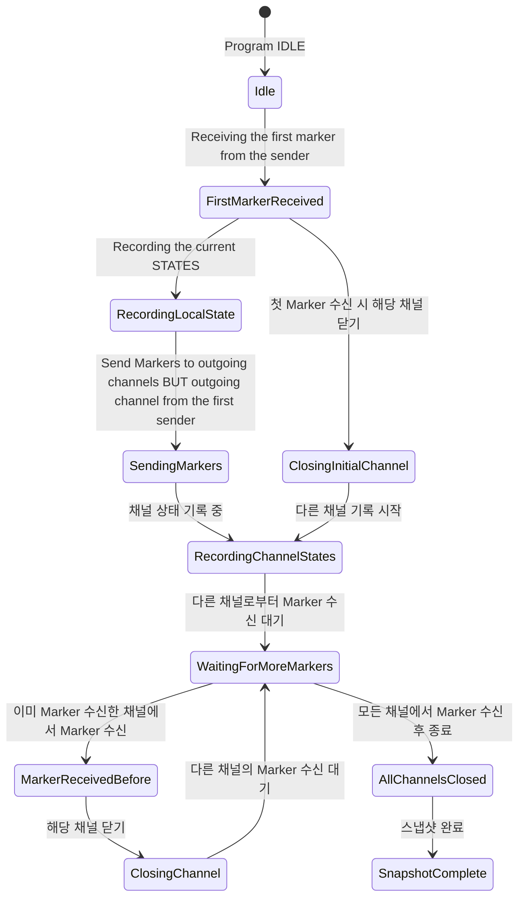

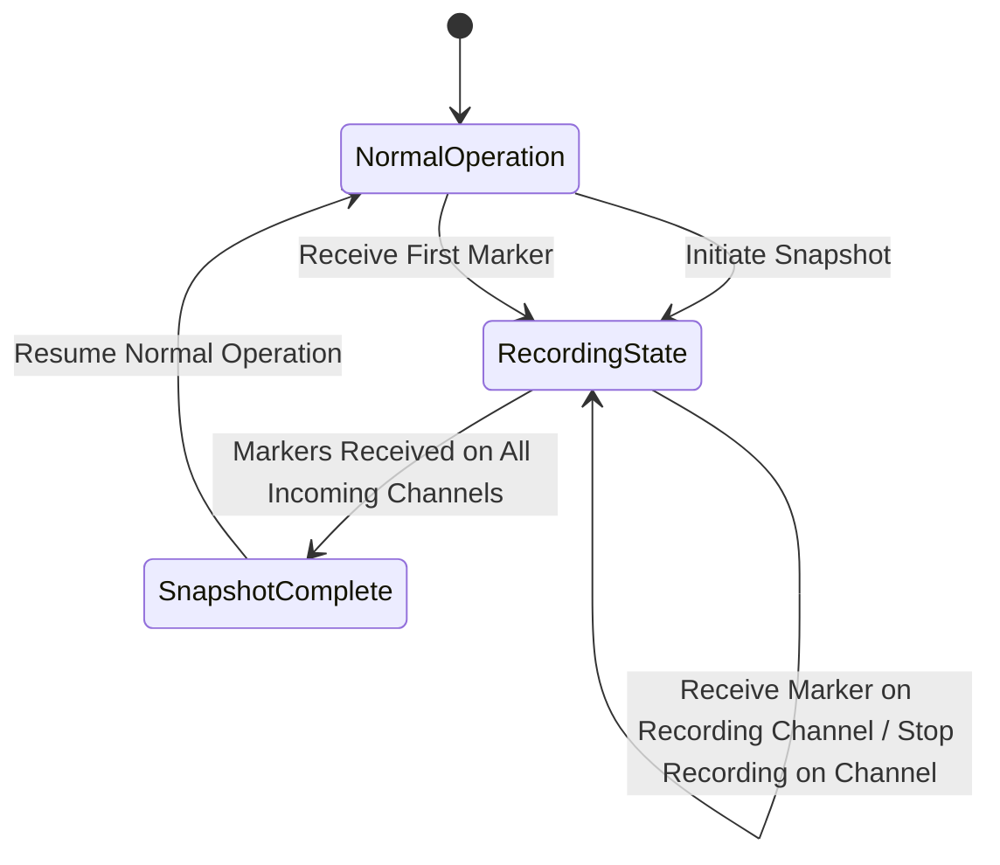
예를 들어 P1,P2,P3,P4가 있으면

  

1. P1이 스냅샷을 시작한다
2. P1이 상태를 저장한다
3. P1 이 P2,P3,P4에 마커를 보낸다
4. P2,P3,P4는 마커를 받은 채널을 폐쇠한다 (더이상 받지 않음)
	1. 폐쇠된 채널
		1. P1->P2
		2. P1->P3
		3. P1->P4
5. P2,P3,P4는 상태저장을 시작한다 (순간저장이 아니라 지속적으로 저장한다)
6. 각각 다른채널로 마커를 보낸다
	1. P2->P3,P4
	2. P3->P2,P4
	3. P4->P3,P4


MARKER 주석

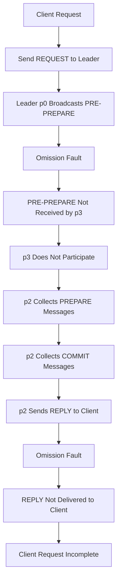

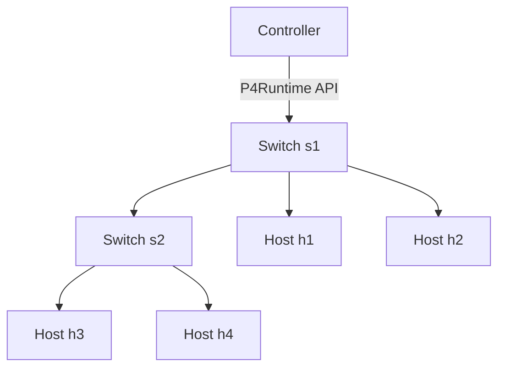

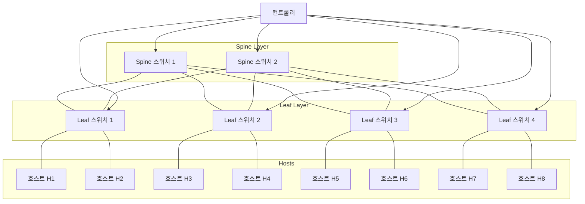


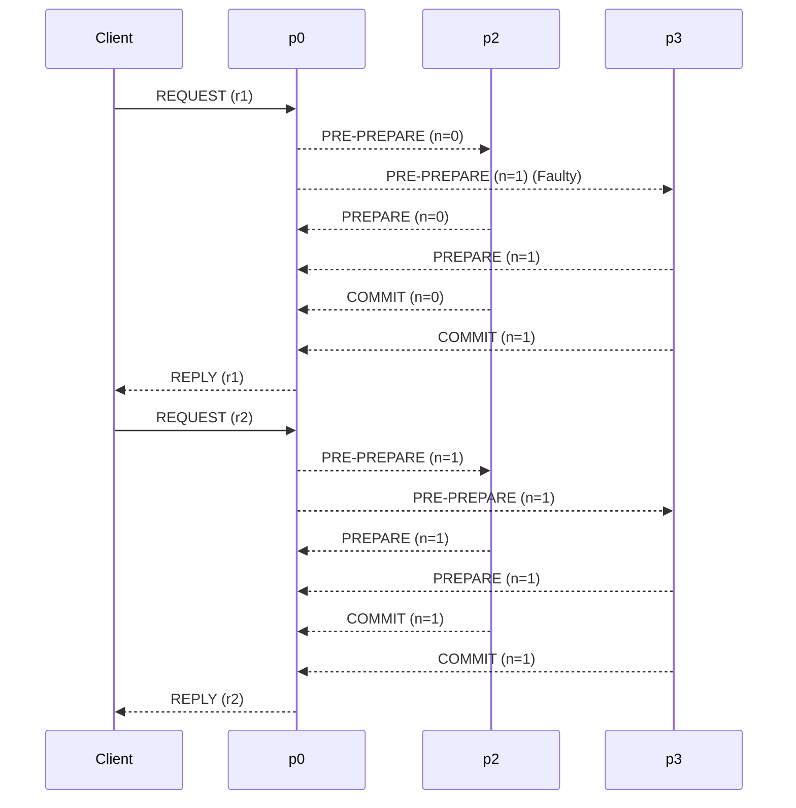

```mermaid
graph TD
    subgraph Controller
        C[Controller]
    end

    subgraph Switches
        S1[Switch S1 (BMv2)]
        S2[Switch S2 (BMv2)]
    end

    subgraph Hosts
        H1[Host H1]
        H2[Host H2]
        H3[Host H3]
        H4[Host H4]
    end

    %% Controller to Switch connections
    C -->|P4Runtime API| S1
    C -->|P4Runtime API| S2

    %% Switch to Host connections
    S1 --- H1
    S1 --- H2
    S2 --- H3
    S2 --- H4

    %% Switch to Switch connection
    S1 --- S2

    %% Measurement nodes indication
    H1:::measurement_node
    S1:::measurement_node

    classDef measurement_node fill:#f9f,stroke:#333,stroke-width:2px;

    %% Note: H1 and S1 are measurement nodes

```

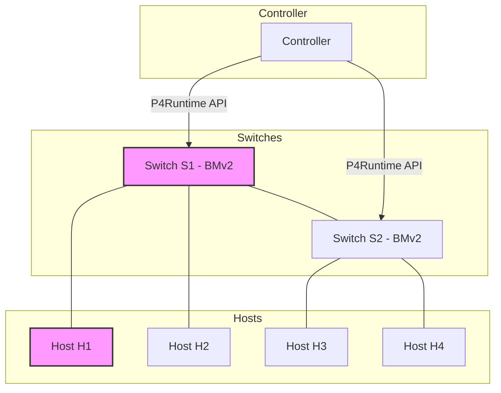

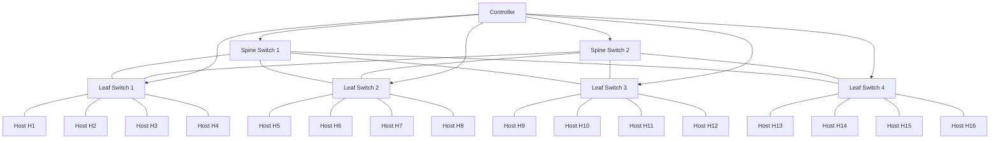

```
```


```mermaid
graph TD
    %% Controller
    Controller[Controller]

    %% Spine Layer
    Spine1[Spine Switch 1]
    Spine2[Spine Switch 2]

    %% Leaf Layer (Programmable Switches)
    Leaf1[Leaf Switch 1 (Programmable)]
    Leaf2[Leaf Switch 2 (Programmable)]
    Leaf3[Leaf Switch 3 (Programmable)]
    Leaf4[Leaf Switch 4 (Programmable)]

    %% Hosts connected to Leaf1
    Client1[Client H1]
    Client2[Client H2]
    Server1[Server H3]
    Server2[Server H4]
    Leaf1 --- Client1
    Leaf1 --- Client2
    Leaf1 --- Server1
    Leaf1 --- Server2

    %% Hosts connected to Leaf2
    Client3[Client H5]
    Client4[Client H6]
    Server3[Server H7]
    Server4[Server H8]
    Leaf2 --- Client3
    Leaf2 --- Client4
    Leaf2 --- Server3
    Leaf2 --- Server4

    %% Hosts connected to Leaf3
    Client5[Client H9]
    Client6[Client H10]
    Server5[Server H11]
    Server6[Server H12]
    Leaf3 --- Client5
    Leaf3 --- Client6
    Leaf3 --- Server5
    Leaf3 --- Server6

    %% Hosts connected to Leaf4
    Client7[Client H13]
    Client8[Client H14]
    Server7[Server H15]
    Server8[Server H16]
    Leaf4 --- Client7
    Leaf4 --- Client8
    Leaf4 --- Server7
    Leaf4 --- Server8

    %% Spine-Leaf connections
    Spine1 --- Leaf1
    Spine1 --- Leaf2
    Spine1 --- Leaf3
    Spine1 --- Leaf4

    Spine2 --- Leaf1
    Spine2 --- Leaf2
    Spine2 --- Leaf3
    Spine2 --- Leaf4

    %% Controller connections
    Controller --> Spine1
    Controller --> Spine2
    Controller --> Leaf1
    Controller --> Leaf2
    Controller --> Leaf3
    Controller --> Leaf4
```

```mermaid
graph TD
    %% Controller
    Controller[Controller]

    %% Spine Layer
    Spine1[Spine Switch 1]
    Spine2[Spine Switch 2]

    %% Leaf Layer (Programmable Switches)
    Leaf1[Leaf Switch 1 Programmable]
    Leaf2[Leaf Switch 2 Programmable]
    Leaf3[Leaf Switch 3 Programmable]
    Leaf4[Leaf Switch 4 Programmable]

    %% Hosts connected to Leaf1
    Client1[Client H1]
    Client2[Client H2]
    Server1[Server H3]
    Server2[Server H4]
    Leaf1 --- Client1
    Leaf1 --- Client2
    Leaf1 --- Server1
    Leaf1 --- Server2

    %% Hosts connected to Leaf2
    Client3[Client H5]
    Client4[Client H6]
    Server3[Server H7]
    Server4[Server H8]
    Leaf2 --- Client3
    Leaf2 --- Client4
    Leaf2 --- Server3
    Leaf2 --- Server4

    %% Hosts connected to Leaf3
    Client5[Client H9]
    Client6[Client H10]
    Server5[Server H11]
    Server6[Server H12]
    Leaf3 --- Client5
    Leaf3 --- Client6
    Leaf3 --- Server5
    Leaf3 --- Server6

    %% Hosts connected to Leaf4
    Client7[Client H13]
    Client8[Client H14]
    Server7[Server H15]
    Server8[Server H16]
    Leaf4 --- Client7
    Leaf4 --- Client8
    Leaf4 --- Server7
    Leaf4 --- Server8

    %% Spine-Leaf connections
    Spine1 --- Leaf1
    Spine1 --- Leaf2
    Spine1 --- Leaf3
    Spine1 --- Leaf4

    Spine2 --- Leaf1
    Spine2 --- Leaf2
    Spine2 --- Leaf3
    Spine2 --- Leaf4

    %% Controller connections
    Controller --> Spine1
    Controller --> Spine2
    Controller --> Leaf1
    Controller --> Leaf2
    Controller --> Leaf3
    Controller --> Leaf4

    %% Measurement nodes indication
    classDef measurement_node fill:#f9f,stroke:#333,stroke-width:2px;
    classDef programmable_switch fill:#cfc,stroke:#333,stroke-width:2px;

    %% Mark measurement nodes (색상 강조)
    Leaf1:::programmable_switch
    Leaf2:::programmable_switch
    Leaf3:::programmable_switch
    Leaf4:::programmable_switch

    Client1:::measurement_node
    Client2:::measurement_node
    Server1:::measurement_node
    Server2:::measurement_node

    %% 노트: 측정을 수행하는 장비들은 색상이 변경되어 있습니다.
```


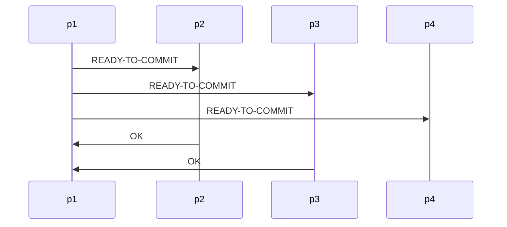

