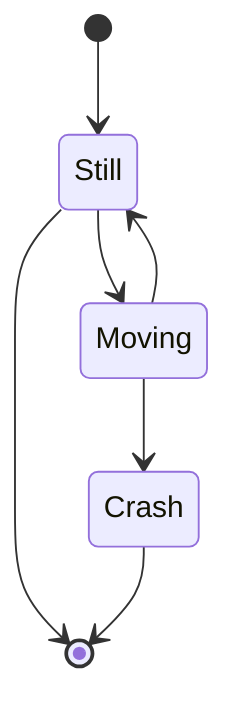
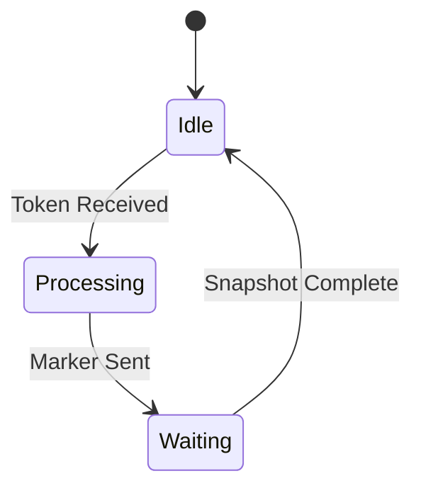

s1 --> s2

```mermaid
stateDiagram-v2
    [*] --> Still
    Still --> [*]

    Still --> Moving
    Moving --> Still
    Moving --> Crash
    Crash --> [*]
```

```mermaid
stateDiagram-v2
[*] --> Idle
Idle --> Processing : Token Received
Processing --> Waiting : Marker Sent
Waiting --> Idle : Snapshot Complete
```
