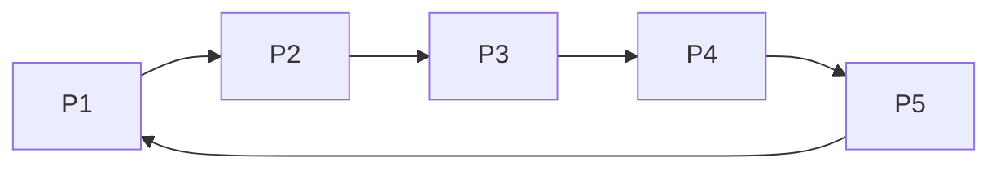

1. 중요한 질문
	1. Payload
		1. Token
			1. Sender ID는 포함되는게 이해가 된다, 보낼때 마다 자기의 State도 같이 보내야 되는가?
				1. 만약에 보내면 받는입장에서 받은 state로 추가 처리를 해야 되는가?
	2. Topology
		1. 토큰링 네트워크 아니냐?
			1. 각 프로세스는 단방향으로 나가고 들어오지 않는가?
			2. 토큰 보낼때 페이로드에 토큰 + 마커를 보내야 되지 않아?
				1. 그럼 나 말고 다른 애들은 예를 들어 P1,2,3 이 있을때 P1->P3를 갈려면 P2를 거쳐야 하지 않나?
		2. 토큰패스만 토큰링이냐? PART2는 관계가 없나?
			1. 근데 왜 2개의 연결이 필요한지 이해가 안된다!
			2. 아니면 1개의 호스트는 모든 노드와 연결이 돼야되나?
	3. State
		1. State 가 받으면 올라간다 = 처음 보내는 애는 1바퀴 돌때마다 1개씩 적다
			1. State를 올리는 시점이 얼마냐
		2. State는 Token, Marker 둘다 쓰냐?
	4. "Record State" 
		1. 알고리즘의 첫번째는 자신의 State를 Save 한다는데, Save한다는 말은 별도의 변수에 넣으면 되나? 그리고 Channel과 다르게 State는 마지막 integer만 들고 있으면 되나?
	5. FIFO 큐
		1. Linear Queue 써도 되나?
	6. Delay
		1. -t : Delay between RECV-SEND
			1. [RECEIVE] ----- DELAY ----- [SEND]
		2. -m : Delay Between RECV-SEND
			1. [RECEIVE] ----- DELAY ----- [SEND]
2. 중간 중요한 질문
	1. State Diagram 1,2 둘다 해야 되는지?
	2. 기본 딜레이
	3. Print
		1. Token
			1. {proc_id: 4, sender: 4, receiver: 5, message: "[MESSAGE]"} 
				1. Message 에 실제 페이로드를 띄울지 아니면 message를 띄울지
				2. 보내고나서 한번
				3. 받고나서 한번
			2. {proc_id: %d, state: %d}
				1. 메세지를 띄우는 시점이
					1. 받고
					2. 올리고
					3. 프린트
			3. 
3. 하찮은 질문
	1. Delay - Second, right?
	2. READY 띄우기
	3. 기본 딜레이
	

Order in vector clock

{proc_id: 4, sender: 4, receiver: 5, message: "[MESSAGE]"} - 에 실제 페이로드를 띄울지 아니면 message를 띄울지

{proc_id:ID, snapshot_id: SNAP_ID, sender:S_ID, receiver:R_ID, msg:"**marker**",
state:STATE, has_token:YES/NO}

{proc_id:ID, snapshot_id: SNAP_ID, snapshot:"started"}

{proc_id:ID, snapshot_id: SNAP_ID, snapshot:"channel closed", channel:S_ID-R_ID,
queue:[CHANNEL_VALUES]}